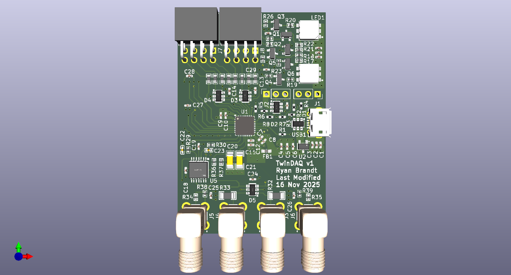
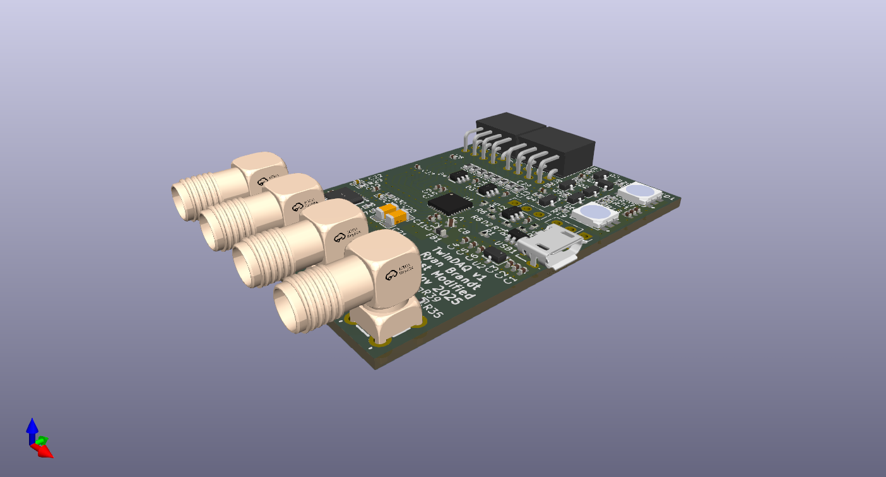
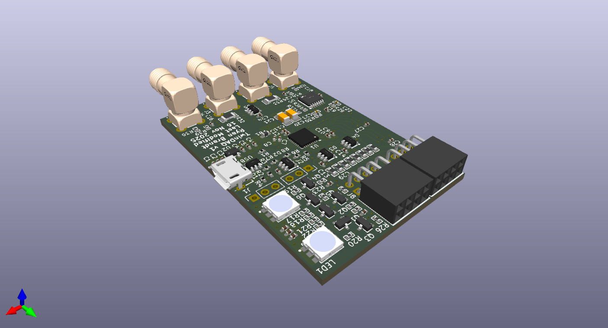
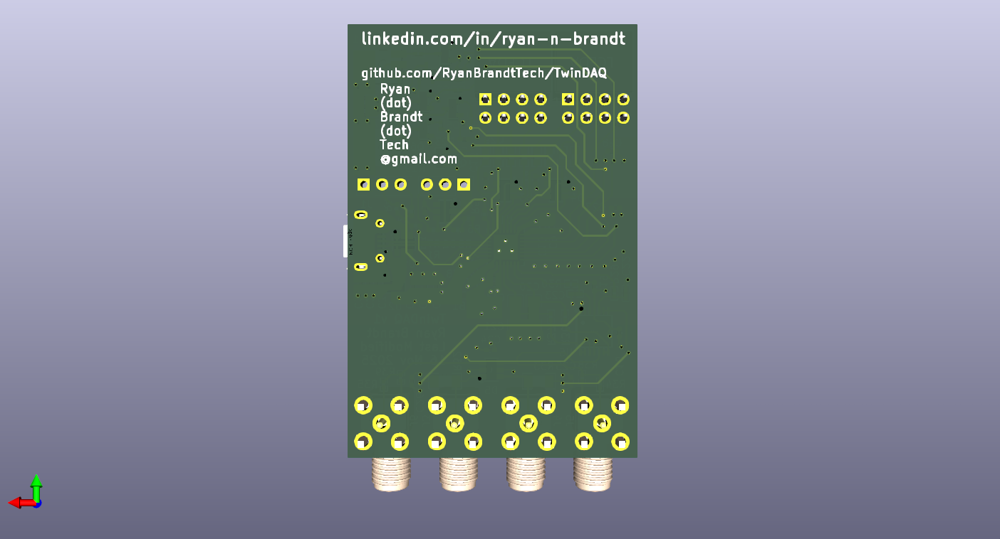

# TwinDAQ
* An STM32-based two-channel analog I/O data acquisition system and development board

## Features
* Two analog inputs accessible with SMA connectors
* Two analog outputs accessible with SMA connectors
* Eight digital GPIO accessible via 0.1" female pin headers
* Two RGB LEDs for visual debugging
* Connector for SWD interfacing
* Connector for UART interfacing
* Micro-USB for 5V power and USB2.0 communications

### Dimensions and Images
40 mm x 60 mm

